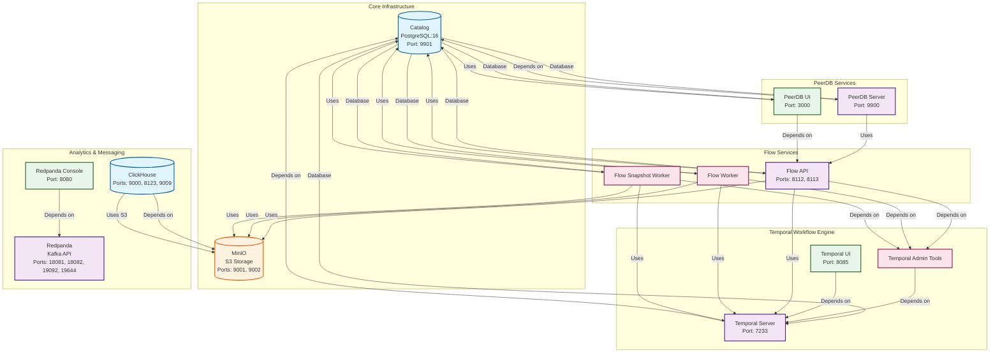

# PeerDB Services Architecture

This document provides a visual representation of the PeerDB services architecture based on the `docker-compose.yml` configuration.

## Architecture Overview

The PeerDB stack consists of multiple service groups working together:

- **Core Infrastructure**: Database and storage services
- **Workflow Engine**: Temporal-based orchestration
- **Flow Services**: Data flow processing workers
- **PeerDB Services**: Main application server and UI
- **Message Queue**: Redpanda for event streaming
- **Object Storage**: MinIO for S3-compatible storage

## Services Architecture Diagram

## Service Details

### Core Infrastructure Services

#### Catalog (PostgreSQL)
- **Container**: `catalog`
- **Image**: `postgres:16-alpine`
- **Port**: `9901:5432`
- **Purpose**: Primary database for catalog metadata and Temporal persistence
- **Health Check**: PostgreSQL readiness check

#### MinIO
- **Container**: `minio`
- **Image**: `minio/minio:RELEASE.2024-07-16T23-46-41Z`
- **Ports**: `9001:9000` (API), `9002:36987` (Console)
- **Purpose**: S3-compatible object storage for data staging and ClickHouse integration
- **Bucket**: `peerdbbucket`

### Temporal Workflow Engine

#### Temporal Server
- **Container**: `temporal`
- **Image**: `temporalio/auto-setup:1.25`
- **Port**: `7233:7233`
- **Purpose**: Workflow orchestration engine
- **Database**: Uses Catalog (PostgreSQL) for persistence

#### Temporal Admin Tools
- **Container**: `temporal-admin-tools`
- **Image**: `temporalio/admin-tools:1.25`
- **Purpose**: Administrative tools for Temporal workflows
- **Health Check**: Temporal workflow list command

#### Temporal UI
- **Container**: `temporal-ui`
- **Image**: `temporalio/ui:2.29.1`
- **Port**: `8085:8080`
- **Purpose**: Web UI for monitoring Temporal workflows

### Flow Services

#### Flow API
- **Container**: `flow_api`
- **Image**: `ghcr.io/peerdb-io/flow-api:latest-dev`
- **Ports**: `8112:8112` (gRPC), `8113:8113` (HTTP)
- **Purpose**: API service for data flow operations
- **Dependencies**: Catalog, Temporal, MinIO

#### Flow Worker
- **Container**: `flow-worker`
- **Image**: `ghcr.io/peerdb-io/flow-worker:latest-dev`
- **Purpose**: Background worker for processing data flows
- **Dependencies**: Catalog, Temporal, MinIO

#### Flow Snapshot Worker
- **Container**: `flow-snapshot-worker`
- **Image**: `ghcr.io/peerdb-io/flow-snapshot-worker:latest-dev`
- **Purpose**: Specialized worker for snapshot operations
- **Dependencies**: Catalog, Temporal, MinIO

### PeerDB Services

#### PeerDB Server
- **Container**: `peerdb-server`
- **Image**: `ghcr.io/peerdb-io/peerdb-server:latest-dev`
- **Port**: `9900:9900`
- **Purpose**: Main PeerDB application server
- **Dependencies**: Catalog, Flow API

#### PeerDB UI
- **Container**: `peerdb-ui`
- **Image**: `ghcr.io/peerdb-io/peerdb-ui:latest-dev`
- **Port**: `3000:3000`
- **Purpose**: Web-based user interface for PeerDB
- **Dependencies**: Catalog, Flow API

### Analytics & Messaging

#### ClickHouse
- **Container**: `clickhouse`
- **Image**: `clickhouse/clickhouse-server:latest`
- **Ports**: `9000:9000` (Native), `8123:8123` (HTTP), `9009:9009` (Inter-server)
- **Purpose**: Columnar database for analytics
- **Storage**: Uses MinIO for S3 integration
- **Health Check**: ClickHouse client query

#### Redpanda
- **Container**: `redpanda`
- **Image**: `ghcr.io/peerdb-io/redpanda:latest-dev`
- **Ports**: 
  - `18081:18081` (Schema Registry)
  - `18082:18082` (Pandaproxy)
  - `19092:19092` (Kafka API)
  - `19644:9644` (Admin API)
- **Purpose**: Kafka-compatible message broker
- **Health Check**: Cluster health check

#### Redpanda Console
- **Container**: `redpanda-console`
- **Image**: `docker.redpanda.com/redpandadata/console:latest`
- **Port**: `8080:8080`
- **Purpose**: Web UI for Redpanda/Kafka management
- **Dependencies**: Redpanda

## Service Dependencies

### Dependency Chain

1. **Foundation Layer**
   - `catalog` (PostgreSQL) - No dependencies
   - `minio` - No dependencies

2. **Workflow Layer**
   - `temporal` → depends on `catalog`
   - `temporal-admin-tools` → depends on `temporal`
   - `temporal-ui` → depends on `temporal`

3. **Flow Layer**
   - `flow-api` → depends on `temporal-admin-tools` (health check)
   - `flow-worker` → depends on `temporal-admin-tools` (health check)
   - `flow-snapshot-worker` → depends on `temporal-admin-tools` (health check)

4. **Application Layer**
   - `peerdb` → depends on `catalog` (health check)
   - `peerdb-ui` → depends on `flow-api`

5. **Storage & Messaging Layer**
   - `clickhouse` → depends on `minio`
   - `redpanda` - No dependencies
   - `redpanda-console` → depends on `redpanda`

## Network Configuration

- **Network Name**: `peerdb_network`
- **Network Type**: Default bridge network
- **Extra Hosts**: `host.docker.internal:host-gateway` (for accessing host services)

## Volumes

- `pgdata` - PostgreSQL data persistence
- `minio-data` - MinIO object storage
- `clickhouse-data` - ClickHouse data directory
- `clickhouse-logs` - ClickHouse log files
- `redpanda-data` - Redpanda data persistence

## Port Mapping Summary

| Service | Internal Port | External Port | Protocol |
|---------|--------------|---------------|----------|
| Catalog | 5432 | 9901 | PostgreSQL |
| Temporal | 7233 | 7233 | gRPC |
| Temporal UI | 8080 | 8085 | HTTP |
| Flow API | 8112, 8113 | 8112, 8113 | gRPC, HTTP |
| PeerDB Server | 9900 | 9900 | gRPC/HTTP |
| PeerDB UI | 3000 | 3000 | HTTP |
| MinIO API | 9000 | 9001 | S3 API |
| MinIO Console | 36987 | 9002 | HTTP |
| ClickHouse Native | 9000 | 9000 | Native |
| ClickHouse HTTP | 8123 | 8123 | HTTP |
| ClickHouse Inter-server | 9009 | 9009 | Native |
| Redpanda Schema Registry | 8081 | 18081 | HTTP |
| Redpanda Pandaproxy | 8082 | 18082 | HTTP |
| Redpanda Kafka API | 9092 | 19092 | Kafka |
| Redpanda Admin API | 9644 | 19644 | HTTP |
| Redpanda Console | 8080 | 8080 | HTTP |

## Health Checks

All services implement health checks to ensure proper startup ordering:

- **Catalog**: PostgreSQL readiness (`pg_isready`)
- **Temporal Admin Tools**: Temporal workflow list command
- **ClickHouse**: ClickHouse client query (`SELECT 1`)
- **Redpanda**: Cluster health check (`rpk cluster health`)
- **Redpanda Console**: HTTP health endpoint (`/api/health`)

## Environment Configuration

The architecture uses YAML anchors for shared configuration:

- `*catalog-config`: Database connection settings
- `*minio-config`: S3/MinIO credentials and endpoint
- `*flow-worker-env`: Temporal and AWS configuration for flow workers

